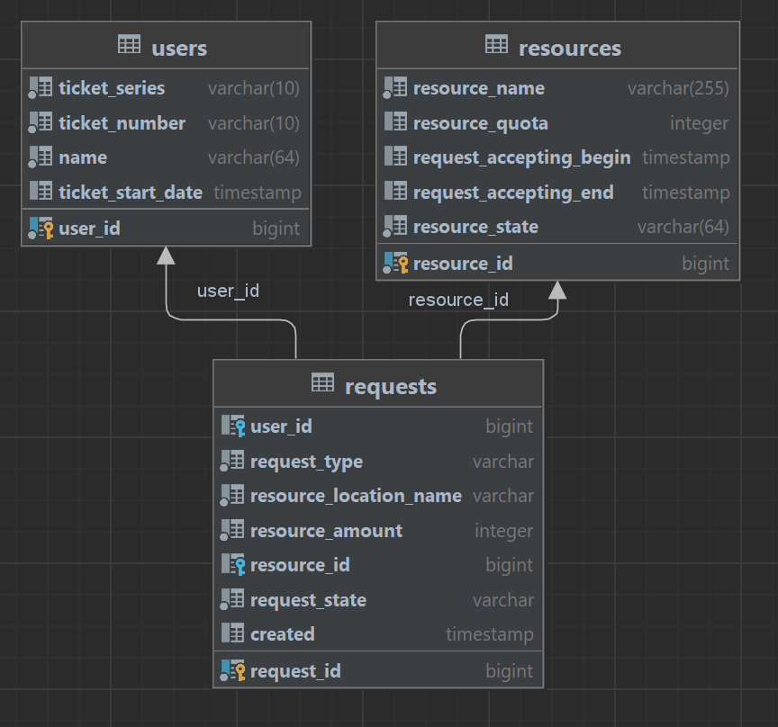

# «Автоматическое распределение заявок на добычу охотничьих ресурсов»

RESTful-сервис (CRUD) для управления данными заявок на добычу охотничьих ресурсов. 

Состав данных заявки:
1. ФИО
2. Тип заявки (массовые виды или жеребьевочные)
3. Дата выдачи охотбилета
4. Серия охотбилета
5. Номер охотбилета
6. Запрашиваемые ресурсы
7. Район ресурса
8. Название ресурса
9. Количество ресурса
10. Статус рассмотрения ресурса
11. Статус рассмотрения заявки

Эндпоинты для взаимодействия с сервером:
1) Post "/resource" - регистрация ресурса (должен содержать тело запроса, см. ниже). 
2) Patch "/resource/{resourceId}" - изменение ресурса (должен содержать тело запроса, при этом может быть как один параметр тела, так и все).
3) Get "/resource/{resourceId}" - возврат ресурса по ID;
4) Delete "/resource/{resourceId}" - удаление ресурса по ID;

Пример Json объекта для регистрации ресурса:
{
    "name": "hog",
    "quota": 10,
    "requestAcceptingBegin": "2020-04-06T16:23:40",
    "requestAcceptingEnd": "2040-04-06T16:23:40"
}

Эндпоинты для взаимодействия с сервером:
1) Post "/requests" - регистрация запроса (должен содержать тело запроса, см. ниже).
2) Patch "/requests/{requestId}" - изменение запроса (должен содержать тело запроса, при этом может быть как один параметр тела, так и все, заявителя менять нельзя).
3) Get "/requests/{requestId}" - возврат запроса по ID;
4) Delete "/requests/{requestId}" - удаление запроса по ID;

Пример Json объекта для регистрации заявки:
{
    "name": "Rick Sanches",
    "requestType": "DRAW_TYPES",
    "ticketStartDate": "2020-04-06T16:23:40",
    "ticketSeries": "1",
    "ticketNumber": "1",
    "resourceId": 1,
    "resourceLocationName": "moon",
    "resourceAmount": 10
}

По каждому ресурсу предусмотрена квота, ограничивающая общее количество запрашиваемых ресурсов и сроки подачи заявок в виде даты начала и даты окончания.

Данные хранятся в БД PostgreSQL.
Схема БД:

Предусмотрена функция автоматической проверять заявок. Имеется операция старта и остановки проверки "на лету". 
Заявки проверяются поочередно, в зависимости от срока поступления.
Заявки одобряются если:
1) Уникальным заявителем запрошено количество ресурсов, не превышающих общий размер квоты на ресурс.
2) Нет одобренных заявок на запрошенный ресурс в других районах промысла.
3) Дата подачи заявки вписывается в рамки сроков подачи на этот ресурс.

Эндпоинты для взаимодействия с сервером:
1) Patch "/requests/startChecking" - старт проверки "на лету"
2) Patch "/requests/stopChecking" - останов проверки "на лету"
3) Patch "/requests/checkAll" - проверка заявок "из очереди"

Написаны тесты для проверки работоспособности сервиса и его компонентов.

Для развертывания приложения добавлен и настроен docker-compose.yml

